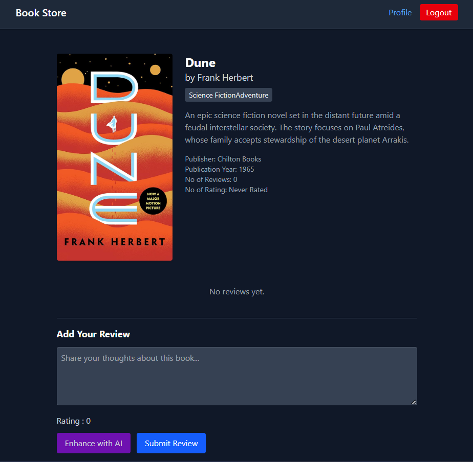
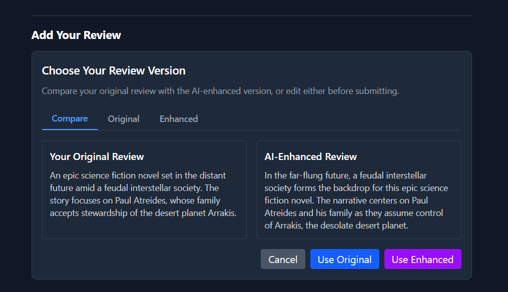

# BookStore - Book Review Platform

BookStore is a comprehensive book review platform where users can browse books, read and write reviews, and interact with a community of readers. Built with the MERN stack (MongoDB, Express, React, Node.js), this application provides a responsive and user-friendly interface for book enthusiasts.


## Features

### User Authentication

- Complete user registration and login system
- JWT-based authentication for secure access
- User profile management with bio updates and password changes

### Book Management

- Browse featured books on the homepage
- Comprehensive book listing with advanced filters
- Detailed book information including description, publication details, and cover images
- Admin-only book addition capability

### Review System

- Read reviews from other users
- Submit personal reviews for books
- One review per user per book policy
- Review listing sorted by most recent
- **AI-Powered Review Enhancement** - Refine your reviews with Google Gemini AI assistance

### User Experience

- Responsive design for all device sizes
- Intuitive navigation with a clean interface
- Loading states and error handling for better user feedback
- Password visibility toggle for improved form interaction

## Screenshots

### Homepage


_Featured books and welcome message for users_

### Book Listing


_Complete book catalog with filtering options by genre, year, and search terms_

### Book Details


_Detailed book information with reviews and review submission form_

### User Profile


_User profile page with editable information_

### Authentication


_User login interface_


_New user registration interface_

### AI Review Enhancement


_AI-powered review refinement using Google Gemini_

## Tech Stack

### Frontend

- **React**: UI library for building the user interface
- **React Router**: For client-side routing
- **Zustand**: State management solution
- **Tailwind CSS**: Utility-first CSS framework for styling
- **Lucide React**: Icon library for UI elements
- **React Hot Toast**: For toast notifications

### Backend

- **Node.js**: JavaScript runtime for the server
- **Express**: Web framework for Node.js
- **MongoDB**: NoSQL database
- **Mongoose**: Object modeling tool for MongoDB
- **bcryptjs**: For password hashing
- **JWT**: For authentication tokens
- **Google Gemini AI**: For AI-powered review enhancement

## API Endpoints

### Authentication

- `POST /api/auth/signup` - Register a new user
- `POST /api/auth/login` - Authenticate user
- `POST /api/auth/logout` - Logout user
- `GET /api/auth/check` - Check authentication status

### Books

- `GET /api/books` - Get all books (with pagination and filtering)
- `GET /api/books/:id` - Get details of a specific book
- `POST /api/books` - Add a new book (admin only)

### Reviews

- `GET /api/reviews/:bookId` - Get all reviews for a specific book
- `POST /api/reviews/:bookId` - Submit a new review for a book
- `POST /api/reviews/refine/:bookId` - Refine a review using AI assistance

### Users

- `GET /api/users/:id` - Get user profile information
- `GET /api/users/me` - Get current user's profile
- `PUT /api/users/profile` - Update user profile

## AI-Powered Review Enhancement

The platform integrates Google's Gemini AI to help users refine their book reviews. This feature:

- Improves grammar, flow, and clarity of reviews
- Maintains the original opinions and sentiment
- Preserves the review's overall length
- Provides a polished version that users can choose to use

To use this feature:

1. Write your initial review
2. Click the "Enhance with AI" button
3. Review the AI-suggested improvements
4. Accept the enhanced version or keep your original

This feature requires a valid Google Gemini API key to be set in the environment variables.

## Setup Instructions

### Prerequisites

- Node.js (v14 or later)
- MongoDB (local installation or MongoDB Atlas account)
- npm or yarn
- Google Gemini API key (for AI review enhancement)

### Installation

1. Clone the repository

```bash
git clone https://github.com/sujal-bansal/bookstore.git
cd bookstore
```

2. Set up environment variables
   Create a `.env` file in the backend directory with the following variables:

```
PORT=5000
MONGO_URI=your_mongodb_connection_string
JWT_SECRET=your_jwt_secret
NODE_ENV=development
GEMINI_API_KEY=your_google_gemini_api_key
```

3. Install backend dependencies

```bash
cd backend
npm install
node seeds/book.seed.js
```

4. Install frontend dependencies

```bash
cd ../frontend
npm install
```

5. Run the application

```bash
# Terminal 1: Start the backend server
cd backend
npm run dev

# Terminal 2: Start the frontend development server
cd frontend
npm start
```

6. The application should now be running at:

- Frontend: http://localhost:5173
- Backend: http://localhost:5000

## Future Enhancements

- Implement book rating system
- Add social features (following users, commenting on reviews)
- Enable book recommendations based on user preferences
- Integrate with external book APIs for expanded catalog
- Expand AI capabilities for book recommendations and content summarization

## Known Issues

- Profile image upload functionality is in development
- Mobile responsiveness can be further improved for some components

## Contributors

- [Sujal Bansal](https://github.com/sujal-bansal)

## License

This project is licensed under the MIT License - see the LICENSE file for details.
